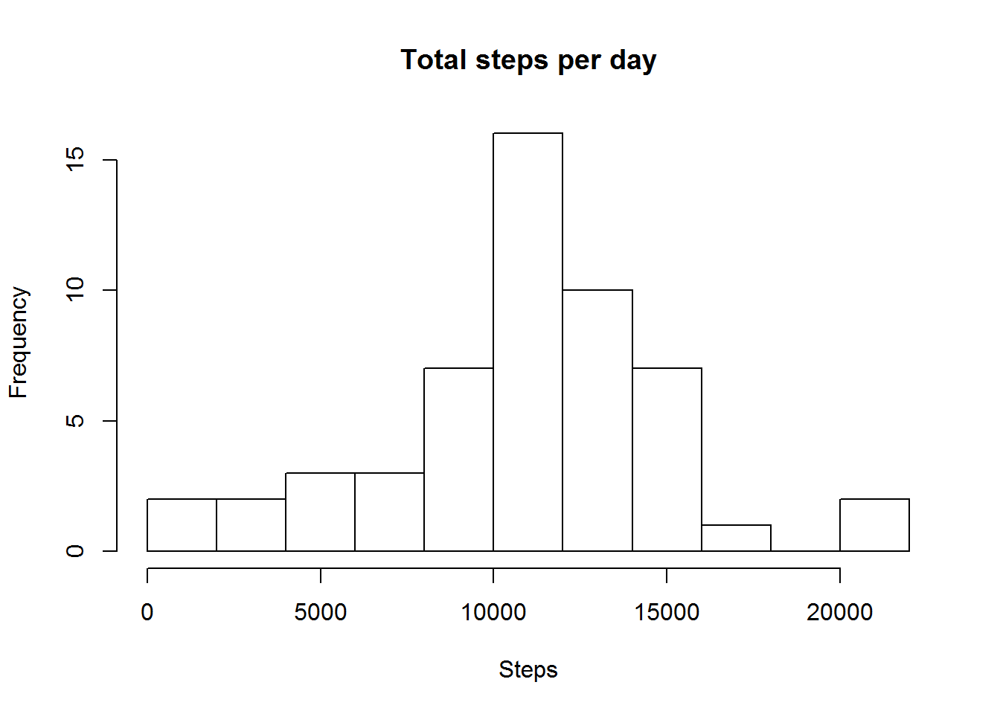
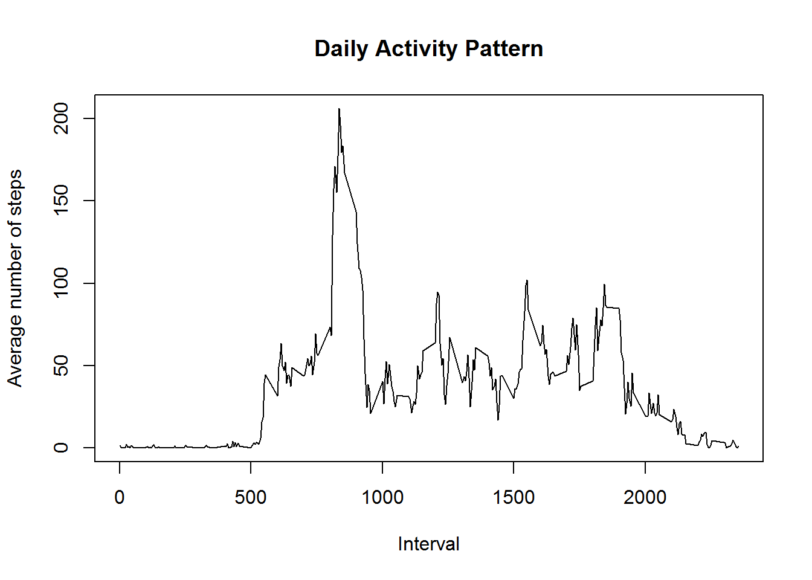
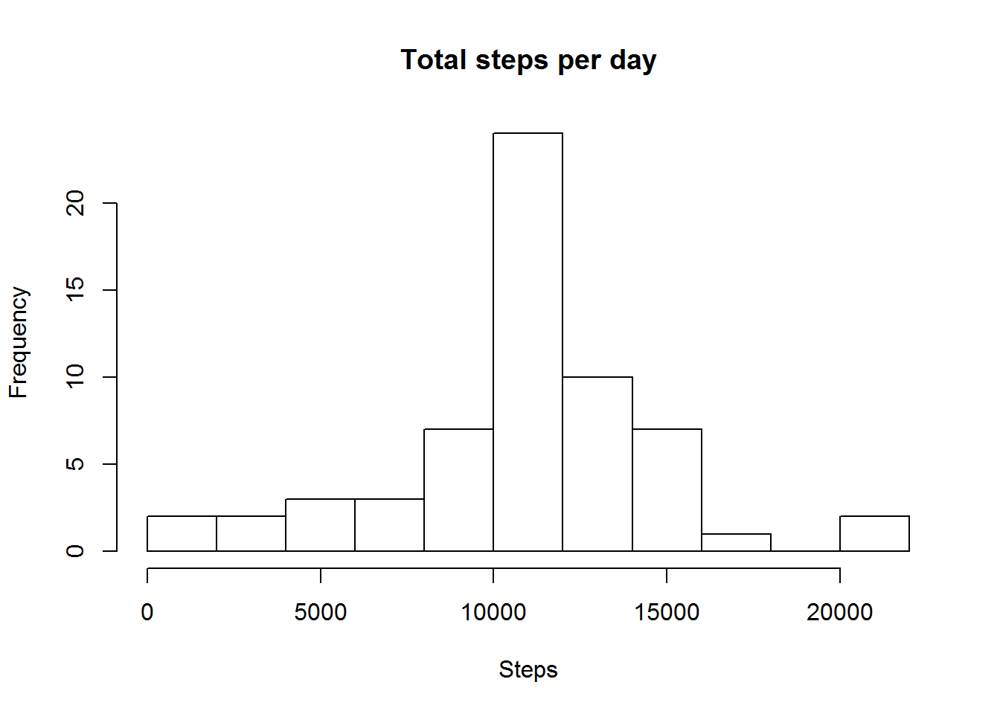
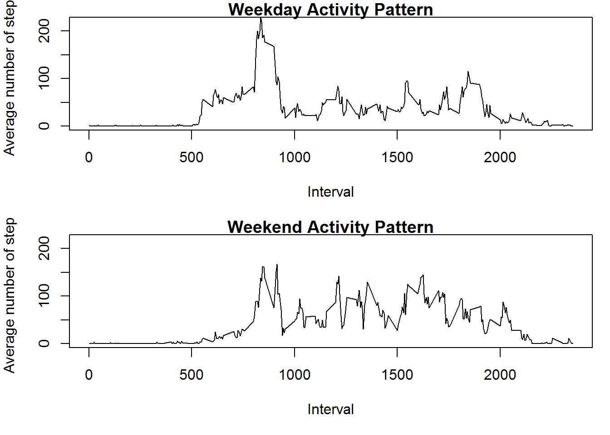

Reproductible Research
----------------------

### Peer-graded Assignment: Course Project 1

**Loading and preprocessing the data**

Show any code that is needed to

1.  Load the data (i.e. read.csv())

<!-- -->

    activity <- read.csv('./activity.csv', header = TRUE)

1.  Process/transform the data (if necessary) into a format suitable for
    your analysis

<!-- -->

    activity$date <- as.Date(activity$date)

**What is mean total number of steps taken per day?**

*For this part of the assignment, you can ignore the missing values in
the dataset.*

1.  Calculate the total number of steps taken per day

<!-- -->

    steps <- tapply(activity$steps, activity$date, sum, na.rm=FALSE)

1.  If you do not understand the difference between a histogram and a
    barplot, research the difference between them. Make a histogram of
    the total number of steps taken each day

<!-- -->

    hist(steps,10,main="Total steps per day",xlab = "Steps")

1.  Calculate and report the mean and median of the total number of
    steps taken per day

<!-- -->

    mean(steps, na.rm = TRUE)

    ## [1] 10766.19

    median(steps, na.rm=TRUE)

    ## [1] 10765

**What is the average daily activity pattern?**

1.  Make a time series plot (i.e. type = "l") of the 5-minute
    interval (x-axis) and the average number of steps taken, averaged
    across all days (y-axis)

<!-- -->

    activity_clean<-activity[which(!is.na(activity$steps)),]
    steps_mean <- tapply(activity_clean$steps, activity_clean$interval, mean)
    plot(y = steps_mean, x = names(steps_mean), type = "l", xlab = "Interval", 
        main = "Daily Activity Pattern", ylab = "Average number of steps")

1.  Which 5-minute interval, on average across all the days in the
    dataset, contains the maximum number of steps?

<!-- -->

    steps_mean[steps_mean==max(steps_mean)]

    ##      835 
    ## 206.1698

**Imputing missing values**

Note that there are a number of days/intervals where there are missing
values (coded as NA). The presence of missing days may introduce bias
into some calculations or summaries of the data.

1.  Calculate and report the total number of missing values in the
    dataset (i.e. the total number of rows with NAs)

<!-- -->

    sum(is.na(activity))

    ## [1] 2304

1.  Devise a strategy for filling in all of the missing values in
    the dataset. The strategy does not need to be sophisticated. For
    example, you could use the mean/median for that day, or the mean for
    that 5-minute interval, etc.

*I will use the mean for that 5-minute interval*

1.  Create a new dataset that is equal to the original dataset but with
    the missing data filled in.

<!-- -->

    activity_new<-activity
    activity_new[which(is.na(activity_new$steps)),1]<-
        steps_mean[as.character(activity_new[which(is.na(activity_new$steps)),3])]

1.  Make a histogram of the total number of steps taken each day and
    Calculate and report the mean and median total number of steps taken
    per day. Do these values differ from the estimates from the first
    part of the assignment? What is the impact of imputing missing data
    on the estimates of the total daily number of steps?

<!-- -->

    steps_new <- tapply(activity_new$steps, activity_new$date, sum, na.rm=FALSE)
    hist(steps_new,10,main="Total steps per day",xlab = "Steps")

    mean(steps_new, na.rm = TRUE)

    ## [1] 10766.19

    median(steps_new, na.rm=TRUE)

    ## [1] 10766.19

*Impact is minimal*

    mean(steps_new, na.rm = TRUE)-mean(steps, na.rm = TRUE)

    ## [1] 0

    median(steps_new, na.rm=TRUE)-median(steps, na.rm=TRUE)

    ## [1] 1.188679

**Are there differences in activity patterns between weekdays and
weekends?**

For this part the weekdays() function may be of some help here. Use the
dataset with the filled-in missing values for this part.

1.  Create a new factor variable in the dataset with two levels -
    "weekday" and "weekend" indicating whether a given date is a weekday
    or weekend day.

<!-- -->

    activity_new$weekdays<-weekdays(activity_new$date)
    activity_new$factor<- as.factor(c("weekend", "weekday"))
    activity_new[activity_new$weekdays == "Sunday" | activity_new$weekdays == "Saturday" ,5]<- factor("weekend")
    activity_new[!(activity_new$weekdays == "Sunday" | activity_new$weekdays == "Saturday"),5 ]<- factor("weekday")

1.  Make a panel plot containing a time series plot (i.e. type = "l") of
    the 5-minute interval (x-axis) and the average number of steps
    taken, averaged across all weekday days or weekend days (y-axis).
    See the README file in the GitHub repository to see an example of
    what this plot should look like using simulated data.

<!-- -->

    activity_new_weekday <- subset(activity_new, factor == "weekday")
    activity_new_weekend <- subset(activity_new, factor == "weekend")
    steps_mean_weekday <- tapply(activity_new_weekday$steps, activity_new_weekday$interval, mean)
    steps_mean_weekend <- tapply(activity_new_weekend$steps, activity_new_weekend$interval, mean)
    par(mfrow=c(2,1), mar = c(5, 4, 1, 1))
    plot(y = steps_mean_weekday, x = names(steps_mean_weekday), type = "l", xlab = "Interval", main = "Weekday Activity Pattern", ylab = "Average number of steps", ylim=c(0,220))
    plot(y = steps_mean_weekend, x = names(steps_mean_weekend), type = "l", xlab = "Interval", main = "Weekend Activity Pattern", ylab = "Average number of steps", ylim = c(0,220))

*By comparing the plots we can conclude that the activity this
individual does during the weekday is higher compared to the weekend.*
